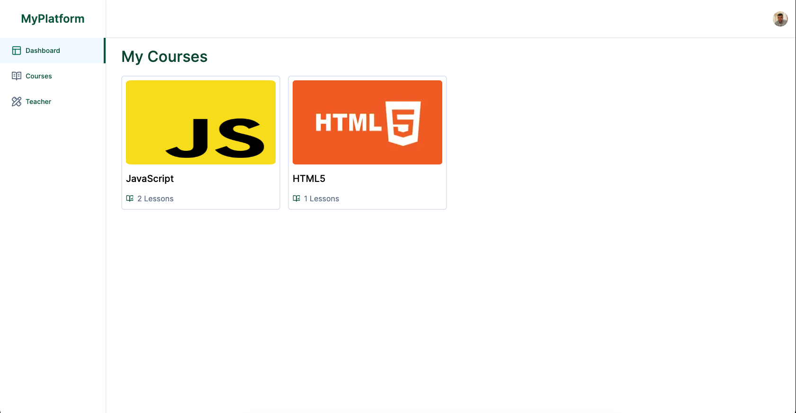

# MyPlatform is an LMS designed for creating, managing and delivering courses online.



MyPlatform is an LMS platform inspired by the Code With Antonio video [Build a Course & LMS Platform: Next 13, React, Stripe, Mux, Prisma, Tailwind, MySQL | Udemy Clone](https://www.youtube.com/watch?v=Big_aFLmekI)
Initially, I followed the tutorial, but later I decided to stop following the tutorial and use the video as a reference, and developing the platform by myself.

During the development process, I learned a lot about Next.js, Prisma, TypeScript, Uploadthing, Tailwind CSS, Shadcn/ui, Zod, and many other things, including how to host a PostgreSQL database online and how to work with it. Initially, I used Vercel for hosting, but later switched to SupaBase for more database storage.

## Getting Started

First, clone the repository

```shell
git clone https://github.com/marceloxhenrique/myPlatform2.0.git
```

## Install packages

```shell
npm install
```

## Setup .env file

```js
NEXT_PUBLIC_CLERK_PUBLISHABLE_KEY=
CLERK_SECRET_KEY=
NEXT_PUBLIC_CLERK_SIGN_IN_URL=
NEXT_PUBLIC_CLERK_SIGN_UP_URL=
NEXT_PUBLIC_CLERK_AFTER_SIGN_IN_URL=
NEXT_PUBLIC_CLERK_AFTER_SIGN_UP_URL=

DATABASE_URL=

NEXT_PUBLIC_TEACHER_ID1=

UPLOADTHING_SECRET=
UPLOADTHING_APP_ID=
```

## Setup Prisma

```shell
npm prisma generate
npx prisma db push
```

## Start the app

```shell
npm run dev
```
